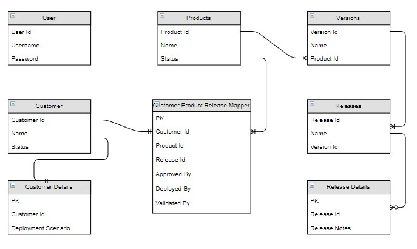
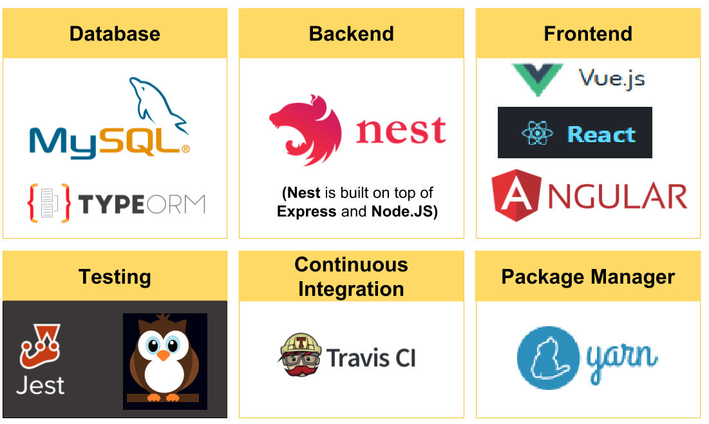

# Release Tracker

>**** **Project is under Development** ****

## Overview
Release Treacker is for Software Products that are available for GA to customers and track Hot fixes &amp; Patches delivered.

This project is built to mitigate challanges that we usually face when managing different versions of our product and track Hotfix or Patches that are delivered to customers.

Below is the highlevel overview on the entities and their relations

* `Users` - One or more users who manages the application
* `Products` - One or more Products can be defined in the application
* `Versions` - Each Product can have one or more versions
* `Releases` - Each Version of a Product can have one or more releases ( GA, Patches, Hotfixes)
* `Customers` - One or more Customers can be defined in the application. A customer can have one or more products deployed at their end with a specific release one at a time. There cannot be two releases for a same product available at the customer.

## Application Stack

Release Tracker will comprise of 
* Rest Interface Backend - Nest Js + TypeORM + MySql
* User Interface - Vue / React / Angular
* Mobile Interface - React Native
* Unit Testing - Jest
* E2E Testing - Night Watch
* CI - Travis CI
* CD
    * AWS EC2 Ubuntu instances Provisioning through Terraform
    * Deployment - Docker Swarm with Traefik as Reverse Proxy

## Functional Requirements

### Users

- [ ] Define specific roles supported in the application
- [ ] Ability to Create/Update User with username, password and role.
- [ ] Ability to fetch all or specific user details
- [ ] Ability to delete or inactivate a user
- [ ] Ability to login to the application with valid credentials
- [ ] Ability to view features w.r.t role assigned to the logged in user

### Products

- [ ] Ability to Create one or more products in the appication
- [ ] Ability to capture notes or required information for a product
- [ ] Ability to view all versions that are released for a product
- [ ] Ability to view all customers who has this product installed w.r.t specific version/release
- [ ] Ability to view timeline for releases done to a product

### Versions

- [ ] Ability to Create one or more versions for a product
- [ ] Ability to view all releases done for a specific version of a product
- [ ] Ability to capture notes or required information for a version
- [ ] Ability to view all reported issues across all the customers for specific product version with their status

### Releases

- [ ] Ability to create one or more releases to a version of the product
- [ ] Each version will have a mapping release done.
- [ ] Ability to view customers who at specific release of the product
- [ ] Ability to capture what is included in the release (Issues or Enhancements)
- [ ] Ability to capture unit tests that should be executed after applying this release at customer

### Customers

- [ ] Ability to create a Customer and map one or more products that are available in the application with specific release of the product
- [ ] Ability to capture notes or deployment scenario for all/individual project deployed at customer
- [ ] Ability to view timeline for releases deployed for a product at customer
- [ ] Ability to track issues reported by this customer and see their status
- [ ] Ability to show applicable release that the customer can upgrade to
- [ ] Ability to capture information on when and who deployed the release
- [ ] Ability to capture information on who validated the release - Executed all test cases

### Reports

- [ ] Issues reported at specific version of product
- [ ] No of releases done to specific version of a product
- [ ] No of releases done during specific duration across all versions for a specific product
- [ ] No of Open/In Progress/Completed issues across all versions for a specific product